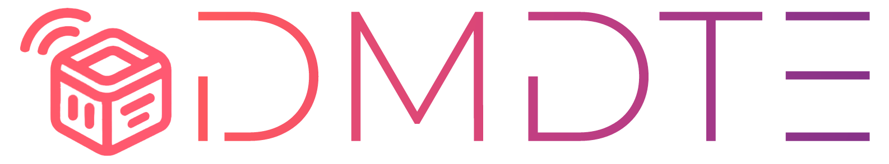

# DMDTE: Distributed Multi-Agent Digital Twin Environment


An open-source framework for orchestrating and simulating distributed **Multi-Agent Digital Twins** in 3D virtual environments, built on **Godot Engine** and featuring native integration with embedded/IoT systems (**ESP32**, **Arduino Alvik**).

The framework implements the architectural principles described in:

> *Russo, M., Santoro, C., Santoro, F. F., & Tudisco, A.* — **"Advancing Robotic Systems with Distributed Multi-Agent Digital Twins: A Scalable and Adaptive Framework"** (SN Computer Science, 2025).

---

## System Architecture

The project follows the **DMDTE (Distributed Multi-Agent Digital Twin Environment)** paradigm, decoupling the physical robotic layer from the virtual emulation:

```
[ Real Agent (Arduino Alvik / ESP32) ]
              ▲
              │  (Digital Twin Protocol over ENet/UDP)
              ▼
[ Local Digital Twin (Godot Engine) ] ◄── (Ghost / Model)
              ▲
              │  (Godot Multiplayer API / RPC)
              ▼
[ Remote Virtual Worlds / Observer Instances ]
```

### Core Concepts

* **DTP (Digital Twin Protocol):** A lightweight binary application-layer protocol running over connection-oriented UDP (via ENet). It provides:
  * **State Synchronization (Properties):** Automatic and periodic property syncing with configurable ownership semantics.
  * **Remote Procedure Calls (RPC):** Bidirectional remote method invocation between physical and virtual twins.
  * **Dynamic Agent Identification:** Automatic handshake identifying the connected real agent to spawn the matching virtual counterpart.
* **Ghost / Model Pattern:**
  * **Ghost:** A passive virtual representation synchronized with real-time hardware telemetry (odometry/pose, battery, sensors). It does not interact with the virtual physics engine.
  * **Model:** An active 3D entity with rigid body physics, collision detection, and navigation controllers. Model physical interactions dynamically feed back into the real agent's motion control.
* **Distributed Scene Replication:** Seamless synchronization across multiple Godot instances through Godot's High-Level Multiplayer API (`MultiplayerSpawner` and `MultiplayerSynchronizer`).

---

## Tech Stack

* **Simulation & Orchestration:** [Godot Engine 4](https://godotengine.org/) (GDScript, Physics/Navigation Server, High-Level Multiplayer API).
* **Firmware & Embedded Systems:** C++17 (ESP-IDF / FreeRTOS / Arduino Core) employing modern idioms such as **CRTP** and **Pimpl** (`BaseRAI`).
* **Networking:** [ENet](http://enet.bespin.org/) for low-latency, reliable/unreliable UDP transport.
  * *Includes a custom [ENet port for ESP32](https://github.com/marcospampi/enet) adapted for lwIP and FreeRTOS.*

---

## Repository Structure

```
.
├── alvik/              # Arduino Alvik example used for the Demo
│   ├── src/               # ClientAbstraction and ENet wrapper
├── godot/                 # Godot Engine project
│   ├── scripts/        # DTPNetwork, DTPPeer nodes & GDScript serializers
│   ├── assets/         # Custom assets created for the demo
│   └── scenes/         # Digital twin scenes, Virtual environments, arenas, and multiplayer logic
└── README.md
```

---

## Quickstart

### 1. Prerequisites

* **Godot Engine 4.x**
* **VS Code** with the **PlatformIO** extension (or Arduino IDE with ESP32 board support)
* **Arduino Alvik** robot or any compatible **ESP32** board

### 2. Embedded Firmware Setup (Real Agent)

1. Navigate to the desired agent directory (e.g., `/alvik`).
2. Configure Wi-Fi credentials and the target Godot host IP/Port (via the built-in serial JSON uploader `preferences` utility under `misc/preferences`).
3. Compile and flash the firmware to your board:
   ```bash
   pio run --target upload
   ```

### 3. Launching the Godot Host

1. Open the `/godot` folder in Godot Engine.
2. Run the main scene containing the `DTPNetwork` manager node.
3. Power on the real agent: upon Wi-Fi connection, it will perform the ENet handshake and instantiate its corresponding digital twin in the virtual environment.

---

## Experimental Case Study: Tank Battle Demo

The framework has been evaluated through a distributed multiplayer tank battle demo:
* **Physics & Kinematics Feedback:** Virtual collisions computed in Godot immediately adjust and halt physical motors on the Arduino Alvik.
* **Game Mechanics Integration:** Health points (visualized as detachable balloons), parabolic projectile firing, and respawn mechanisms synchronized between digital twins and physical platforms.
* **Heterogeneous Support:** Integration of distinct agent types operating concurrently (e.g., mobile Alvik robots and an ESP32-powered smart traffic light).

---

## Authors

* **Marco Spampinato** — *University of Catania*
  * **Supervisor:** Prof. Federico Fausto Santoro PhD
  * **Co-Supervisor:** Dr. Alessio Tudisco
  * **Friends & Support:** Dr. Mario Bonanno, Dr. Angelo Spadola, Dr. Andrea Leone, Dr. Miriana Russo, Damiano Coppola

<p style="color: transparent">Grazie Mario</p>